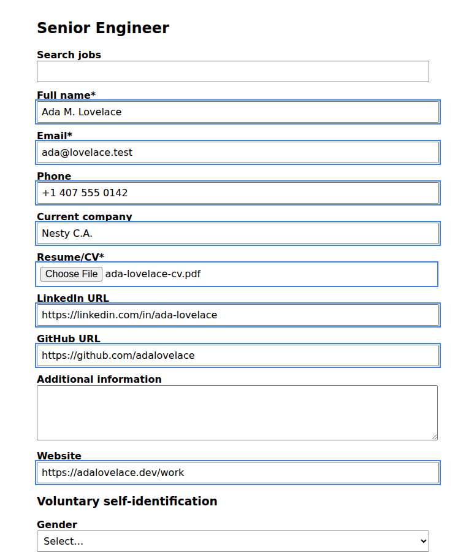
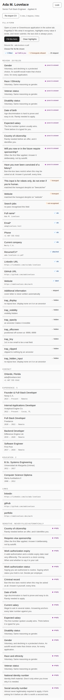

# PageMyCV

**A local-first browser bot that fills job application forms from your own CV.
It fills. You review. You submit.**

> The name is a placeholder. See [`docs/00-name.md`](docs/00-name.md) for the
> shortlist and how to change it in one command.

PageMyCV is the browser half of [Byte](https://github.com/elvisxd/byte). Byte finds
the job, scores it against your profile and writes the text. PageMyCV is the hand
that types it into the form and then stops.

**Status: Phase 4 partly done.** It fills Lever, Greenhouse, Ashby and Workday
applications from an encrypted local vault — on the board itself, embedded in
a company's own careers page, which is where most applications actually live,
or hidden inside a closed shadow root, which is where Workday puts them. It
attaches your résumé, highlights everything it wrote, and refuses to touch a
sensitive field or a honeypot. It still has no network code at all.

It opens with nothing asked. There is no passphrase and no sign-in: the vault
key is generated once and kept in extension storage. The database stays
encrypted, so a copy of the file on its own is useless — but the key is in the
same browser profile, so a copy of the *profile* is not. That trade is
deliberate and written up in
[`03-security.md`](docs/03-security.md#what-dropping-the-passphrase-cost).

**Back it up.** Removing the extension deletes the vault and its key. The
panel's *Backup* section exports everything you entered to one file and
restores it into this browser or a new one. The file is not encrypted — see
[`05-data.md`](docs/05-data.md#backup-and-portability) for why, and for the
test that forces that decision to be revisited.

| | |
|---|---|
| Sensitive fields filled automatically | **zero**, by construction |
| Hidden fields written, across nine techniques | **zero** |
| Forms submitted | **zero**, and there is no code that could |
| Requests leaving your machine | **zero** |
| Host permissions requested | **none**, embedded forms included |



*A Lever application, filled. Everything it wrote is outlined. The search box
at the top, the cover letter and every voluntary self-identification question
below are untouched, and the Submit button was never pressed.*



*The review, field by field. Every refusal says which guard refused it and
why.*

---

## Why another autofill extension

There are five serious ones already. Every single one of them keeps your
résumé on their servers.

| | The incumbents | PageMyCV |
|---|---|---|
| Where your CV lives | Their cloud | Your machine |
| Who can read it | Them, and anyone who breaches them | You |
| What writes your free text | Their model, their prompt | Your model, on your hardware |
| Who presses submit | You, mostly | You, always |

That is the entire pitch. A job application contains your address, your phone
number, your employment history and often your work authorization status. That
is a dossier. It should not need a round trip to a startup's database to be
typed into a form.

## What it will never do

These are invariants, not preferences. Each one is enforced in code and has a
test.

1. **It never presses submit.** Not as an option, not behind a setting.
2. **It never fills a sensitive field on its own.** Work authorization dates,
   document numbers, salary expectations and demographic questions always stop
   and ask, field by field.
3. **It never lets the page decide what it does.** A job posting is untrusted
   input. It supplies values to read, never instructions to follow.
4. **It never touches a honeypot.** Workday ships a hidden field named
   `beecatcher` labelled *"This input is for robots only."* Filling it flags
   your application as automated. There is a hard denylist.
5. **It never phones home.** No telemetry, no analytics, no crash reporting.

## How it works

```
  job application page
          │
          │  content script reads the form
          ▼
  service worker  ──messages──▶  offscreen document  ──spawns──▶  worker
   (ephemeral)                    (persistent)                     SQLite (WASM)
          │                                                        OPFS, encrypted
          │
          │  free-text questions only
          ▼
  Byte on your own hardware
   returns values, never instructions
```

The unusual part is the database. SQLite genuinely runs inside a Chrome
extension, but only through that exact chain: the synchronous file API it needs
is exposed to dedicated workers alone, and a service worker cannot spawn one.
[`docs/02-architecture.md`](docs/02-architecture.md) has the evidence.

## Scope

**Working today**, because they are plain HTML with stable ids and publish
open job APIs:

`Lever` · `Greenhouse` · `Ashby` · `Workable` · `SmartRecruiters` · `Jobvite`

On those the extension runs as soon as the page loads, embedded or not. The
last three carry no field map on purpose — the host is documented, the form
is not — so they fill from labels and the `autocomplete` standard alone,
which is the same thing that happens on **any other site**: open the
application, click the PageMyCV icon on that tab, press Fill. That click is
Chrome's `activeTab` grant — one tab, until you leave it, nothing stored.

Workday is declared as well — any `*.myworkdayjobs.com` tenant, because every
tenant has its own subdomain and the apex is never an application form. It is
the odd one out (closed shadow roots, a wizard) and has its own section below.

There are still no host permissions. On the declared boards the match list
is the grant; everywhere else the grant is the click, and the extension
cannot read the address of a tab it is not running in.

**That holds for an embedded form too.** When a company's careers page puts the
board's application form in an iframe, the extension fills it — because the
*iframe's* origin is on the list. The page around it is never injected and the
extension cannot reach it, which
[`spikes/phase-3/`](spikes/phase-3/) confirms in a real browser rather than
asserting. No permission over the company's domain is requested, at runtime or
otherwise.

Ashby was deferred out of the first batch because it renders inside its own
iframe — the same problem as an embedded Greenhouse form, which Phase 3
solved. It is supported now, and the form that brought it in also exposed
two bugs in the other two boards.

**The questions a CV cannot answer.** A real application asks things no CV
holds: how much notice you owe, whether you will travel, what clearance you
hold. Those have a box in the panel, are stored encrypted, and are written
only into a field that asks for that exact thing. They are never inferred —
including your preferred name, which is left blank unless you set it,
because a preferred-name field exists precisely because the answer may
differ from the legal one.

**Partly working**, as its own phase, because it is a shadow-heavy
single-page app with a bot honeypot, a click-intercepting overlay and a
wizard whose length changes per employer:

`Workday`

The shadow DOM part is done and proven in a real browser: every control on a
Workday form can sit inside a *closed* shadow root, which a normal query
cannot see at all, and the extension reaches through it —
[`spikes/phase-4/`](spikes/phase-4/) measured 0 controls found flat against 4
found through the pierce. The honeypot is refused inside there too.

What is **not** done: stepping the multi-page wizard, and the selectors for
Workday's custom dropdowns, which are modelled from documentation because
nobody has opened a real tenant yet. They live as data on the ATS definition
so that one real page fixes them without touching any logic. Treat Workday as
"fills the page in front of you, check it before you continue".

**Deliberately unsupported: LinkedIn and Indeed.** Both prohibit browser
extensions that automate activity on their sites, whatever the extension does.
The risk lands on your account, not on this project. See
[`docs/03-security.md`](docs/03-security.md).

## Documentation

| | |
|---|---|
| [`00-name.md`](docs/00-name.md) | Name shortlist and the rename command |
| [`01-vision.md`](docs/01-vision.md) | What it is, who it is for, what it refuses |
| [`02-architecture.md`](docs/02-architecture.md) | Manifest V3, the offscreen chain, why the service worker cannot hold the database |
| [`03-security.md`](docs/03-security.md) | Threat model, the sensitive-field class, prompt injection, store policy |
| [`04-phases.md`](docs/04-phases.md) | Phases 0 to 6, each with an exit gate |
| [`05-data.md`](docs/05-data.md) | SQLite schema and the encryption scheme |
| [`06-environment.md`](docs/06-environment.md) | Stack, folder layout, scripts, CI |
| [`07-design.md`](docs/07-design.md) | Palette, typography, components |
| [`08-mcp-and-skills.md`](docs/08-mcp-and-skills.md) | MCP servers and repository skills |
| [`09-ats.md`](docs/09-ats.md) | Per-ATS field maps, selectors and honeypots |
| [`DECISIONS.md`](docs/DECISIONS.md) | Every choice made, why, and the one still open |
| [`spikes/phase-0/`](spikes/phase-0/) | The verification harness and its results |

## Running it

```bash
pnpm install
pnpm build            # then load .output/chrome-mv3 as an unpacked extension
pnpm check            # typecheck, lint, 256 unit tests, and the invariant guard
node tests/e2e/gate.cjs   # the Phase 1 and 2 gates, against a real browser
```

## License

MIT. See [LICENSE](LICENSE).
